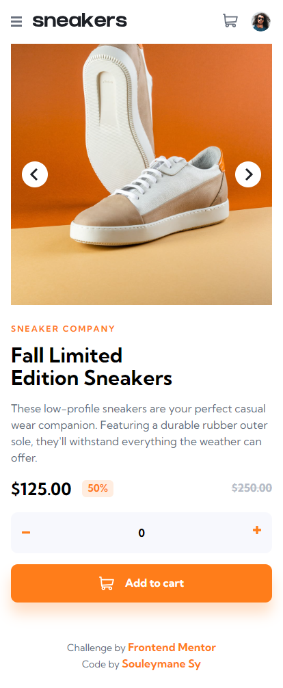
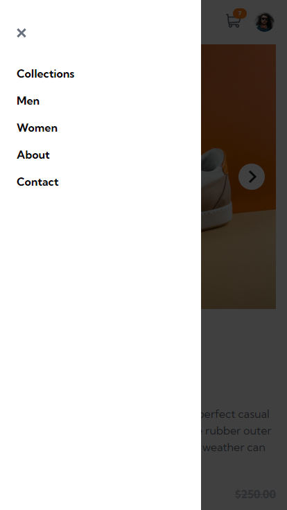
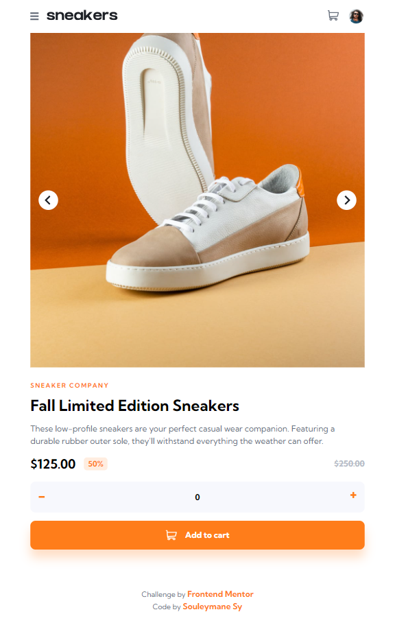
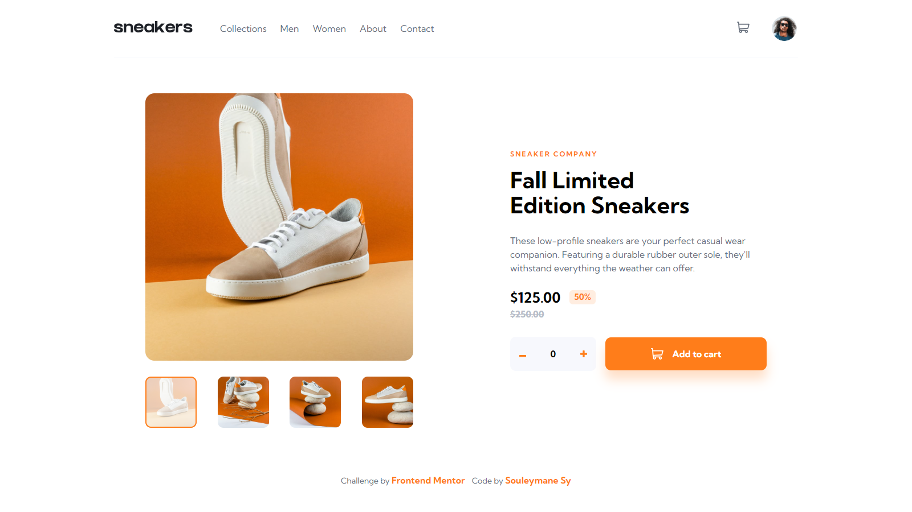
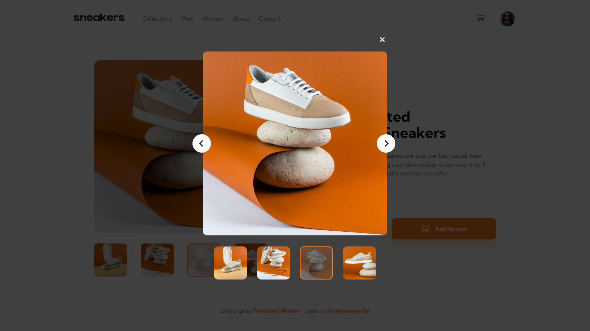
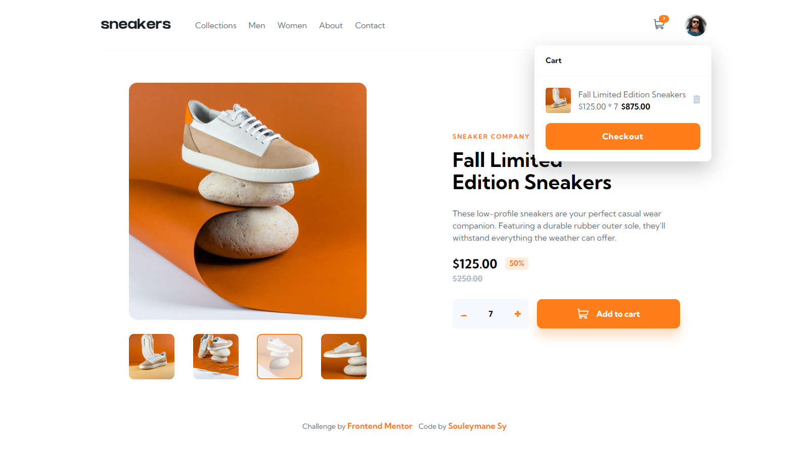

# Frontend Mentor - E-commerce product page


## Links

- Solution URL: [Add solution URL here](https://your-solution-url.com)
- Live Site Demo URL: [Add live site URL here](https://your-live-site-url.com)

## Welcome! 👋

Thanks for checking out this front-end coding challenge.

This is a solution to the [E-commerce product page challenge on Frontend Mentor](https://www.frontendmentor.io/challenges/ecommerce-product-page-UPsZ9MJp6). Frontend Mentor challenges help you improve your coding skills by building realistic projects.

## Table of contents

- [The Challenge](#the-challenge)
- [Screenshots](#screenshots)
- [Built With](#built-with)
- [How To Use This Repos](#how-to-use-this-repos)
- [Author](#author)

## The challenge

The challenge is to build out this e-commerce product page and get it looking as close to the design as possible.

Your users should be able to:

- View the optimal layout for the site depending on their device's screen size
- See hover states for all interactive elements on the page
- Open a lightbox gallery by clicking on the large product image
- Switch the large product image by clicking on the small thumbnail images
- Add items to the cart
- View the cart and remove items from it

## Screenshots

### Mobile



### Mobile Navbar



### Tablets



### Desktop



### Lightbox



### Cart View



## Built with

- Semantic HTML5 markup
- SASS
- CSS custom properties
- Flexbox
- CSS Grid
- Mobile-first workflow
- [Vite Js](https://vitejs.dev/) - Javascript Bundler.
- [PNPM](https://pnpm.io/) - Package Manager.
- [React Js](https://react.dev/) - Javascript Framework.
- [Typescript](https://typescript) - A strongly typed language, builds on top of javascript.

## How To Use This Repos

To clone and run this application, you'll need [Git](https://git-scm.com) and [PNPM](http://pnpm.io/) installed on your computer. From your command line:

```bash
# Clone this repository
$ git clone https://github.com/SouleymaneSy7/fem-e-commerce-products-page

# Install dependencies
$ pnpm install

# start the server
$ pnpm dev
```

## Author

- GitHub - [Souleymane Sy](https://github.com/SouleymaneSy7)
- Frontend Mentor - [@SouleymaneSy7](https://www.frontendmentor.io/profile/SouleymaneSy7)
- Dev Challenges - [Souleymane Sy](https://devchallenges.io/profile/534cd213-3165-4c16-bdcf-058e1f468da0)
- Twitter - [@Souleymanesy43](https://twitter.com/Souleymanesy43)
